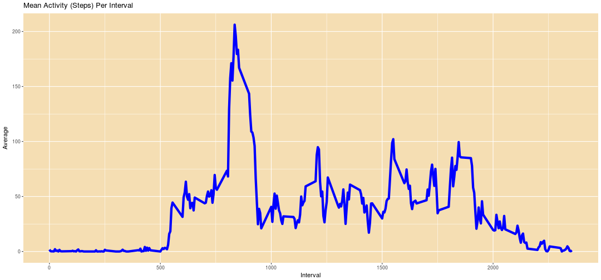
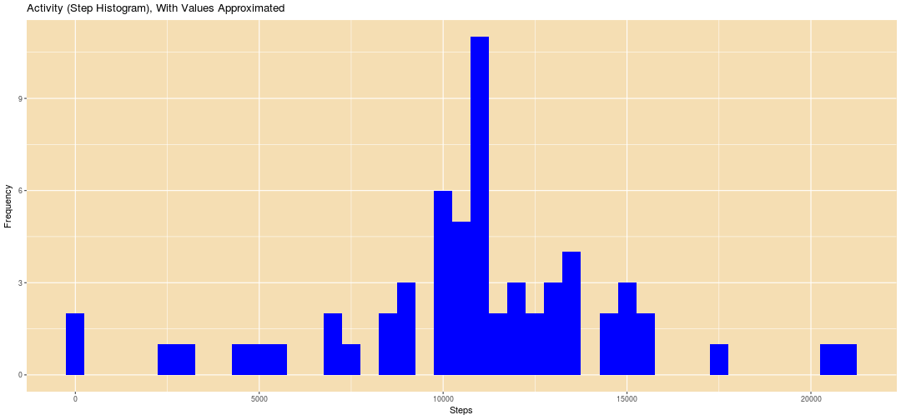

## Loading and preprocessing the data

Load the libraries, Read the data file, then set up the names we will be using. We also will convert the dates to date format and add a data field (day) which identifies weekdays and weekends


```r
library(lubridate)
```

```
## Loading required package: methods
```

```
## 
## Attaching package: 'lubridate'
```

```
## The following object is masked from 'package:base':
## 
##     date
```

```r
library(ggplot2)
library(dplyr)
```

```
## 
## Attaching package: 'dplyr'
```

```
## The following objects are masked from 'package:lubridate':
## 
##     intersect, setdiff, union
```

```
## The following objects are masked from 'package:stats':
## 
##     filter, lag
```

```
## The following objects are masked from 'package:base':
## 
##     intersect, setdiff, setequal, union
```

```r
data <- read.table(file="/data/course5/RepData_PeerAssessment1/activity.csv",sep=",",comment.char="",quote="",header=TRUE)
colnames(data) <- c("steps","date","interval")
data[,'date'] <- ymd(data[,'date'])
data$day <- wday(data[,'date'])
weekend <- c(1,7)
weekday <- c(2,3,4,5,6)
data[data$day %in% weekend,]$day <- "Weekend"
data[data$day %in% weekday,]$day <- "Weekday"
```


## What is mean total number of steps taken per day?
The first part of the analysis is to calculate the total number of steps per day.


The project says that we are looking for the mean and the median of the steps taken, on a per day basis. Here, there are a couple of options.  We can take the mean of the sum on a daily basis, which takes the sum of all the intervals, or we can look at it like an interval based mean.


```r
sum1 <- na.omit(data) %>% group_by(date) %>% summarize(sum = sum(steps))
themean <- mean(sum1$sum)
themean
```

```
## [1] 10766.19
```

```r
#
# looking at an interval mean rather than daily mean
#
mean1 <- na.omit(data) %>% group_by(date) %>% summarize(means = mean(steps))
#  which is the same as
mean(mean1$means)
```

```
## [1] 37.3826
```

```r
meannum <- mean(mean1$means)
meannum
```

```
## [1] 37.3826
```
So the mean is 1.0766189 &times; 10<sup>4</sup> (if we were to consider an interval mean it would be along the line of 37.3825996).      


The median is also interesting, when considered from an interval perspective.  With the number of 0's in the data, the median of all the days (even removing the NA's) is 0. so if we really looked at the median for the intvals, it would return 0, largely because of the number of large number of 0's. As a result we will take the median of the sum averages on a daily basis.


```r
themedian <- median(sum1$sum)
themedian
```

```
## [1] 10765
```

```r
med1 <-  na.omit(data) %>% group_by(date) %>% summarize(med = median(steps))
meda1 <- median(med1$med)
meda1
```

```
## [1] 0
```

```r
med2 <-  na.omit(data) %>% filter(steps != 0) %>% group_by(date) %>% summarize(med = median(steps))

meda2 <- median(med2$med)
meda2
```

```
## [1] 56
```

```r
cnt1 <- na.omit(data) %>% filter(steps != 0) %>% group_by(date) %>% summarize(cnt = n())

cnt2 <- group_by(data,date) %>% summarize(cnt = n())

cnta1 <- mean(cnt1$cnt)
cnta1
```

```
## [1] 80.18868
```

```r
cnta2 <- mean(cnt2$cnt)
cnta2
```

```
## [1] 288
```

```r
meda3 <- median(data$steps,na.rm=TRUE)
meda3
```

```
## [1] 0
```

So as we look a the median, and take a daily persective, if we remove the NA's and leave the 0's the median is 0, and is we remove the 0's we get a median of 56. This is because, on a daily basis there are lots of 0's and NA's in the data (on the average 80.1886792 out of 288 elements on a daily basis.  So for now we will take the median as 10765 for non zero convience. 
    
The histogram, which reflects the frequency of values in our activity set, shown below, reflects counts surrounding the mean to be the highest in the graph..


```r
plt <- ggplot(sum1, aes(x = sum)) + geom_histogram(binwidth=500,fill="blue")
plt <- plt + ggtitle("Activity (Steps Histogram)") 
plt <- plt + theme(panel.background=element_rect(fill="wheat"))
plt <- plt + labs(x = "Steps ", y = "Frequency")
print(plt)
```


## What is the average daily activity pattern?

The pattern below shows a sharp increase in activity at about 5:00 in the morning. This activity slows in the afternoon and then, at about 8:00 PM contines the trend to zero. The interestng element here is the dramatic increase at 7:30 to 8:30. Furter analysis, such as comparison of this data set to other factors (work type, travel type, city/country, data which was not included) would offer greater insight.


```r
int1 <- na.omit(data) %>% group_by(interval) %>% summarize( means = mean(steps))
plt2 <- ggplot(int1, aes(x = interval, y = means)) + geom_line(color = "blue",lwd = 2)
plt2 <- plt2 + ggtitle("Mean Activity (Steps) Per Interval")
plt2 <- plt2 + theme(panel.background=element_rect(fill="wheat"))
plt2 <- plt2 + labs(x = "Interval", y = "Average")
print(plt2)
```



```r
int1[which.max(int1$means),]
```

```
## # A tibble: 1 × 2
##   interval    means
##      <int>    <dbl>
## 1      835 206.1698
```

```r
vals <- int1[which.max(int1$means),]
row <- as.numeric(vals[1,1])
row
```

```
## [1] 835
```

```r
valu <- as.numeric(vals[1,2])
valu
```

```
## [1] 206.1698
```

The max interval across the day is 835 with a value of 206.1698113.


## Inputing missing values

The first part of this question is to identify the number of missing values in the data. 


```r
nummiss <- sum(is.na(data$steps))
nummiss
```

```
## [1] 2304
```

```r
sum2 <- group_by(data,date) %>% summarize(sum = sum(steps))
sum2[is.na(sum2$sum),]$sum <- themean
#
# calculate new mean / median
#
newmean <- mean(sum2$sum)
newmean
```

```
## [1] 10766.19
```

```r
newmed <- median(sum2$sum)
newmed
```

```
## [1] 10766.19
```

So the number missing is 2304. Now we fill in the data (new dataset data2).Next we plot and get the median and mean. There are two specific questions to address   

### Do these values differ from the estimates from the first part of the assignment?   


There is no change in the mean (from 1.0766189 &times; 10<sup>4</sup> to 1.0766189 &times; 10<sup>4</sup>) and very little in the median 10765 to 1.0766189 &times; 10<sup>4</sup>.  The reason for no chage in the mean is because for every data point we add, we add the mean to that data point, which does not change the average.  In a similar fasion the median changes very little, becuase we have added the mean as in to number set being considered for the median, making a selection near it likely.


### What is the impact of inputing missing data on the estimates of the total daily number of steps?

As noted before, by adding data, the frequency of the mean (which was inserted) increase. The plot is reflective of that.


```r
plt3 <- ggplot(sum2, aes(x = sum)) + geom_histogram(binwidth=500,fill="blue")
plt3 <- plt3 + ggtitle("Activity (Step Histogram), With Values Approximated")
plt3 <- plt3 + theme(panel.background=element_rect(fill="wheat"))
plt3 <- plt3 + labs(x = "Steps" , y = "Frequency")
print(plt3)
```




## Are there differences in activity patterns between weekdays and weekends?


```r
daytype <- group_by(data2,interval,day) %>% summarise( means = mean(steps))
```

```
## Error in group_by_(.data, .dots = lazyeval::lazy_dots(...), add = add): object 'data2' not found
```

```r
plt4 <- ggplot(daytype, aes(x = interval, y = means, color = day))
```

```
## Error in ggplot(daytype, aes(x = interval, y = means, color = day)): object 'daytype' not found
```

```r
plt4 <- plt4 + geom_line()
```

```
## Error in eval(expr, envir, enclos): object 'plt4' not found
```

```r
plt4 <- plt4 + facet_wrap( ~day, nrow=2, ncol = 1)
```

```
## Error in eval(expr, envir, enclos): object 'plt4' not found
```

```r
plt4 <- plt4 + ggtitle("Comparison Of Weekday/Weekend Activity")
```

```
## Error in eval(expr, envir, enclos): object 'plt4' not found
```

```r
print(plt4)
```

```
## Error in print(plt4): object 'plt4' not found
```

As is shown in the plot, weekday activity is greater than the weekend activity. The activity now does not spike significantly at the 7:30 AM - 8:30 AM time frame and there is very little activity at 5:00 AM. A hypothsis might be that people do not work on the weekend, that there is less early morning activity. 


# Notes

It should be noted that the assignment called for the use of knit2html, which on the Ubuntu system I am using is depricated.  


**Error: It seems you should call rmarkdown::render() instead of knitr::knit2html() because PA1.Rmd appears to be an R Markdown v2 document.**

Given the error, I have implemented the following shell script,
which calls R to produce the document 


```r
  !/bin/bash    

  input=$1   

  echo Input $input   
  /usr/bin/Rscript -e "library(knitr); library(rmarkdown) ; knit(\"${input}.Rmd\",\"${input}.md\"); render(\"${input}.md\") ; browseURL(\"${input}.html\") "
```


