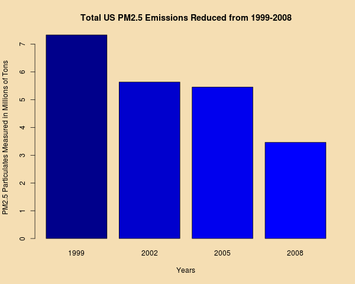
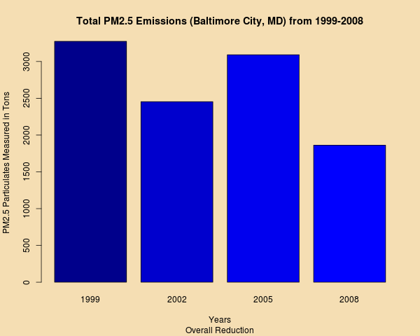
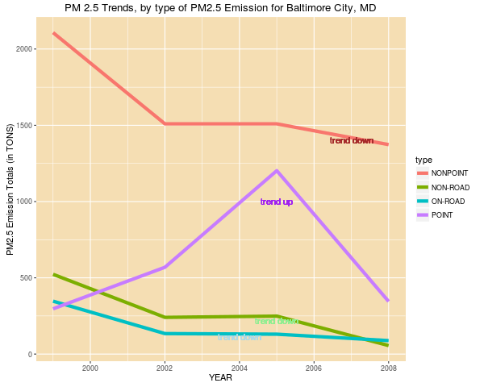

% README
% M.Carmichael
% Sun Dec  4 13:36:45 2016

Assignment

The overall goal of this assignment is to explore the National Emissions Inventory database and see what it says about fine particulate matter pollution in the United States over the 10-year period 1999–2008 (its 9 years). You may use any R package you want to support your analysis.

Questions

You must address the following questions and tasks in your exploratory analysis. For each question/task you will need to make a single plot. Unless specified, you can use any plotting system in R to make your plot.

Response

	This exercise really emphasied the clarity in instruction that is required for this type of assigment. For example, we are asked to find the "largest" chagne, but it is not identified as either percentage or absolute value.  As a result the responses can be considered interpretive. 

--------------------------------------------------------------------------- 

Question 1: Have total emissions from PM2.5 decreased in the United States from 1999 to 2008? Using the base plotting system, make a plot showing the total PM2.5 emission from all sources for each of the years 1999, 2002, 2005, and 2008.

Response : The graph shows a clear reduction, 23% in 2002, 25% in 2005, and a drop by 52% from the level in 1999 

Base Plot 

barplot(q1$sum/10^6, names.arg = q1$year, col=colq1, xlab="Years",
  ylab = "PM2.5 Particulates Measured in Millions of Tons",
  main="Total US PM2.5 Emissions Reduced from 1999-2008")

Question 2 :  Have total emissions from PM2.5 decreased in the Baltimore City, Maryland (𝚏𝚒𝚙𝚜 == "𝟸𝟺𝟻𝟷𝟶") from 1999 to 2008? Use the base plotting system to make a plot answering this question.

Response 2 : Overall yes, with the overall reduction of 43% by 2008.  Having said that, the bargraph shows the up and down nature of change in emissions. While there is a reduction in 2002 (25%) the reduciton in 2005 is only 6% ; as noted before it drops to 43% between 1999 and  2008.

Base Plot 

barplot(q2$sum, names.arg = q2$year, col=colq1, xlab="Years",
  ylab = "PM2.5 Particulates Measured in Tons",
  main="Total PM2.5 Emissions (Baltimore City, MD) from 1999-2008",
  sub=("Overall Reduction"))

Question 3 : Of the four types of sources indicated by the 𝚝𝚢𝚙𝚎 (point, nonpoint, onroad, nonroad) variable, which of these four sources have seen decreases in emissions from 1999–2008 for Baltimore City?

 
Response 3 : As the graph shows, there is a reduction of emissions in NON-POINT,NON-ROAD, and ON-ROAD. The largest drop is NON-POINT (734.4), followed NON-ROAD (467.1) and ON-ROAD (258.5)
 

Question 3a : Which have seen increases in emissions from 1999–2008? 
Response 3a : POINT emission increase by 48.1 or 16%. The interesting part of this is the 305% increase which occurs in 2005

Question 3b :  Use the ggplot2 plotting system to make a plot answer this question. 

Response 3b :

q3p <- ggplot(q3, aes(x = year, y=tot, color=type)) + geom_line(size=2) +
   xlab("YEAR") + ylab("PM2.5 Emission Totals (in TONS)") +
   ggtitle("PM 2.5 Trends, by type of PM2.5 Emission for Baltimore City, MD") +
   geom_text(aes(2004,110,label="trend down"),color="lightblue") +
   geom_text(aes(2005,1000,label="trend up"),color="purple") +
   geom_text(aes(2005,220,label="trend down"),color="lightgreen") +
   geom_text(aes(2007,1400,label="trend down"),color="brown")  +
   theme(panel.background=element_rect(fill="wheat"))

Question 4 : Across the United States, how have emissions from coal combustion-related sources changed from 1999–2008?

Response 4 : The TOTAL drop parallels the drop shown in the POINT drop, with a significant drop from 2005 to 2008. The NON-POINT trend is more linear in nature,  in addition to the POINT emissions having larger numerical values than NON-POINT.

Question 5 : How have emissions from motor vehicle sources changed from 1999–2008 in Baltimore City? 

Response 5 : There is a 75% drop from 1999 to 2008.  The most significant drop however, occurs between 1999 and 2002, 61% and dropping only 14% between 2002 and 2008 (there is an addition 1% drop in 2005

Question 6 : Compare emissions from motor vehicle sources in Baltimore City with emissions from motor vehicle sources in Los Angeles County, California (𝚏𝚒𝚙𝚜 == "𝟶𝟼𝟶𝟹𝟽"). Which city has seen greater changes over time in motor vehicle emissions?

Response 6 : While we see an overall 75% reduction in Baltimore City, MD in emmissions related to ON ROAD emissions, there is actally an overall increase of 4% in Los Angles. In addtion the drop is continously lowering between 1999 and 2008, while the emission are increasing for the first three years in Los Angeles (some 17%) and dropping 13% between 2005 and 2008. On a change basis the greater numeric value is in Los Angeles (670) versus Baltimore City, which has (258), while on a percentage basis Baltimore City had a greater change than Los Angeles.  

